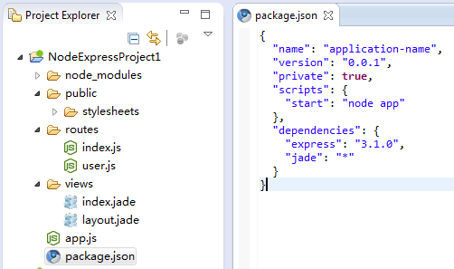
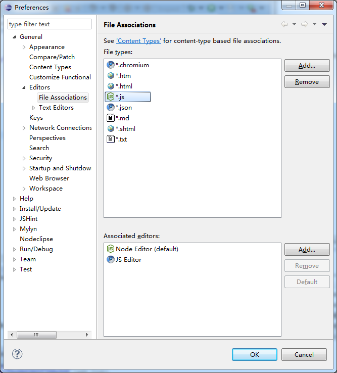

# Hints

## JSON Editor

JSON means JavaScript Object Notation, so you just have to have any JavaScript editor 
and associate the *.json files with it:

    Window > Preferences
    General > Editors > File Associations
    Add... > File type: *.json
    Select *.json file type > Add... (Associated editors) > JavaScript Editor
    Make it default

Now you can now open JSON files with the JavaScript editor (with syntax highlight),
 use the formatter and set your favorite color theme with Eclipse Color Theme.

