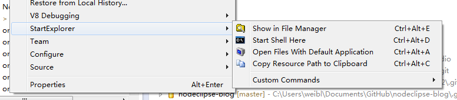

# Roadmap

### 0.3 (April-May 2013)

Is scheduled to come together with NodeEclipse 0.3

### 0.4 (TBD)

## Good plugins

[StartExplorer](http://marketplace.eclipse.org/node/641101)

 

[EasyShell](http://marketplace.eclipse.org/content/easyshell)
Update site: <code>http://pluginbox.sourceforge.net</code>
Some problem with install from China (Sf.net is noo slow)
  

## Next

Eclipse color theme:
http://eclipsecolorthemes.org/?view=plugin 
 
Update site: http://eclipse-color-theme.github.com/update 
 
add desired features here...

### Configure to support JSON

JSON is already supported via JS Editor, some automatic configuration needed. 

# Researching

Everything below is more like research, contribution needed

## JSDoc, JSDuck or what ?

http://en.wikipedia.org/wiki/JSDoc  
http://code.google.com/p/jsdoc-toolkit/  As of 27 June 2010 the JsDoc Toolkit Version 2 encorage -> JSDoc 3  
[jsdoc3](https://github.com/jsdoc3/jsdoc)  

	npm install git://github.com/jsdoc3/jsdoc.git
	jsdoc --debug
	
## JavaScript UML support

[Eclipse MDT uml2tools](http://www.eclipse.org/modeling/mdt/?project=uml2tools#uml2tools) latest news 2008 :-(  
[JSuml](http://jsuml.gaertner-network.de/)  
[jsUML2](http://code.google.com/p/jsuml2/)  project is under development.  
[uml-lab](http://www.uml-lab.com/en/uml-lab/) (yatta.de) Unclear if it supports JavaScript. Round-trip , commercial, 30 days free trial  

### Java only?

http://stackoverflow.com/questions/5672082/eclipse-uml-plugin-with-java-code-generation  

http://marketplace.eclipse.org/content/euml2-free-edition  Date Updated: 18 July 2011 Submitted by: Yves YANG
[eUML2](http://www.soyatec.com/euml2/features/) is built
 on top of [the UML2 framework of Eclipse](http://www.eclipse.org/modeling/mdt/?project=uml2)   
http://jupe.binaervarianz.de/  Quote "... and supports Eclipse 3.2" :-(  
[Eclipse Acceleo](http://www.eclipse.org/acceleo/)  
[The ObjectAid UML Explorer for Eclipse](http://objectaid.com/)   
 Requires [GEF (Graphical Editor Framework)](http://www.eclipse.org/gef/) 3.6.x or higher
 Download site: http://www.objectaid.net/update  (problems with access?)   
[UMLet 12.0 (beta)](http://www.umlet.com/) Free UML Tool for Fast UML Diagrams

http://www.tutego.de/java/eclipse/plugin/eclipse-plugins.html#Entwicklungstools  
->  
http://astah.net/    

http://modeling-languages.com/uml-tools-textual-notations-define-uml-models/  

### In Web 

http://www.websequencediagrams.com/

## Templating

### Jade support

[Eclipse plugin for Jade (Node.js template engine)](http://stackoverflow.com/questions/15610410/eclipse-plugin-for-jade-node-js-template-engine/15610469)

### Jade alternatives

[Natural Templating .html (like Thymeleaf) for Node.js](http://stackoverflow.com/questions/15652602/natural-templating-html-like-thymeleaf-for-node-js)

# Changelog

### 0.2.3

Eclipse Shelled
http://sourceforge.net/apps/trac/shelled/ 

Update site: https://downloads.sourceforge.net/project/shelled/shelled/ShellEd%202.0.2/update

